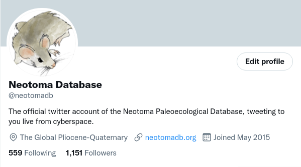

# NeotomaBot

A twitter bot to search for new records in the [Neotoma Paleoecology Database](http://neotomadb.org) and then post them to the [@neotomadb](http://twitter.com/neotomadb) Twitter account.

This program was an experiment to see how good my Python programming skills are.  Apparently they're okay.  The code could probably use some cleaning, but I'm generally happy with the way it turned out.

The program runs on a free [Heroku](https://heroku.com) dyno and tweets semi-regularly.

## Contributors

This project is an open project, and contributions are welcome from any individual.  All contributors to this project are bound by a [code of conduct](CODE_OF_CONDUCT.md).  Please review and follow this code of conduct as part of your contribution.

* [Simon Goring](http://goring.org) 

### Tips for Contributing

Issues and bug reports are always welcome.  Code clean-up, and feature additions can be done either through pull requests to project forks or branches.

## Requirements

This application runs using Python v3.  All required packages are listed in the [requirements.txt](requirements.txt) file, generated using the python package `pipreqs`.

Tweets are pulled either from the [resources/cannedtweets.txt](resources/cannedtweets.txt) or generated using the [Neotoma API](https://api.neotomadb.org) `/v1.5/data/recentuploads/n` endpoint.  This endpoint returns a list of all dataset uploads within the last `n` months using an XML format.

The application requires four environment variables, stored as configuration variables in the Heroku dynamo.  These are the keys required to access the Twitter API.  To obtain these keys for your own use you must add the [Developer status](https://developer.twitter.com) to your existing Twitter account and register an application to obtain the following keys:

* CONSUMER_KEY
* CONSUMER_SECRET
* ACCESS_TOKEN_KEY
* ACCESS_TOKEN_SECRET

### Running Locally

It is possible to run this code locally if you have the environment variables set.  Just run `python3 neotomabot.py`